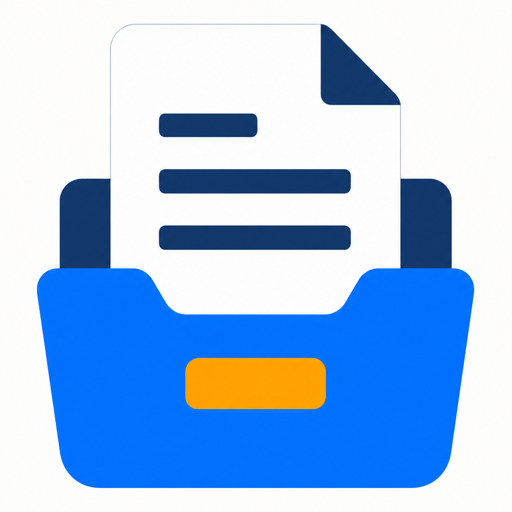
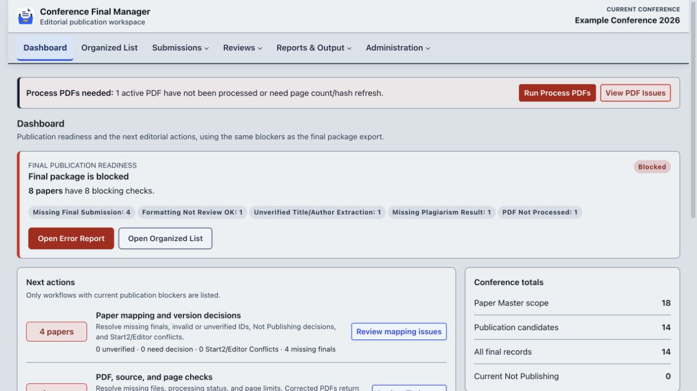
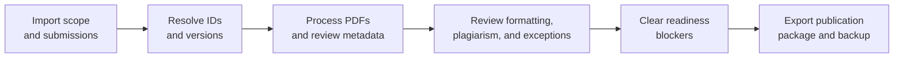
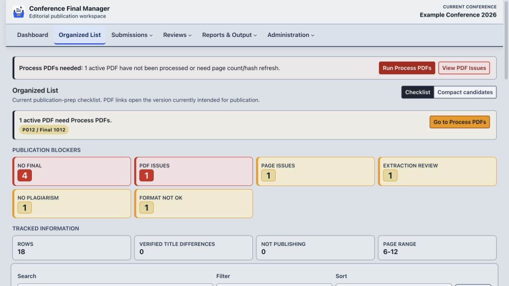

<p align="center">
  
</p>

<h1 align="center">Conference Final Manager</h1>

<p align="center">
  A local-first editorial workspace for turning conference final submissions
  into a verified, auditable publication package.
</p>

<p align="center">
  <strong>Django + SQLite</strong> ·
  <strong>Runs locally</strong> ·
  <strong>Fail-closed publication checks</strong> ·
  <strong>Portable backups</strong>
</p>

<p align="center">
  <a href="#quick-start">Quick start</a> ·
  <a href="#editorial-workflow">Workflow</a> ·
  <a href="docs/operator_guide.md">Operator guide</a> ·
  <a href="docs/README.md">All documentation</a>
</p>



> The preview uses a disposable example conference. No production conference
> data is included in the repository.

## What It Does

Conference Final Manager keeps the complete proceedings-preparation workflow in
one local application:

- imports the Paper Master scope and Final Submission metadata;
- tracks Start2 versions, Editor Uploads, corrected files, and publication
  exclusions;
- processes PDFs and coordinates Paper ID, title/author, formatting,
  plagiarism, author-count, and exception reviews;
- gives Dashboard, Organized List, Error Report, and final export one shared
  definition of publication readiness;
- exports editorial workbooks, CrossCheck packages, and the final publication
  package;
- records state-changing work in an audit log and creates portable System State
  backups.

The application is designed for editors working on a trusted local machine. It
has no login system, cloud database, or hardened public deployment mode.

## Editorial Workflow



The system deliberately fails closed: unresolved version ambiguity, missing or
changed publication files, stale review evidence, and other structural
conflicts block the final package instead of being guessed around.

<details>
<summary><strong>See the publication checklist view</strong></summary>



</details>

## Quick Start

Python 3.12 or newer is required. The first run needs internet access to install
Python packages; normal local operation is offline afterward.

macOS or Linux:

```bash
./scripts/start_local.sh
```

On macOS, you can also open `start.command` from Finder.

Windows:

```text
start_windows.bat
```

Open <http://127.0.0.1:8000/>. The startup scripts create `.venv`, install
requirements, apply migrations, and prepare the local data folders.

### Docker

Docker is optional and intended for trusted local or LAN operation:

```bash
cp .env.example .env.conference-a
docker compose --env-file .env.conference-a up -d --build
```

Use a unique `COMPOSE_PROJECT_NAME`, port, and data mirror for every conference.
See the [Docker Guide](docs/docker_guide.md) before updating, backing up,
migrating, or recovering a Docker instance.

## Publication Safety

The most important rules are:

- Paper Master defines publication scope.
- Editor Upload outranks Start2, but mixed undiscarded sources block final
  export.
- Corrected files outrank Original files; a selected Corrected file that is
  missing never silently falls back.
- Dashboard and final export use the same readiness findings.
- Review state resets only when its documented evidence changes.
- State-changing workflows and exports are audited.

[Publication Rules](docs/publication_rules.md) is the canonical specification.
Do not select publication input by browsing or copying files from `data/`.

## Documentation

| If you want to… | Read |
| --- | --- |
| Understand the documentation set | [Documentation Home](docs/README.md) |
| Run the conference workflow | [Operator Guide](docs/operator_guide.md) |
| Diagnose an error or unexpected result | [Troubleshooting](docs/troubleshooting.md) |
| Install, update, back up, or recover Docker | [Docker Guide](docs/docker_guide.md) |
| Understand publication scope, versions, files, and export rules | [Publication Rules](docs/publication_rules.md) |
| Develop or review code changes | [Developer Guide](docs/developer_guide.md) |
| Understand service boundaries and safety design | [Architecture Notes](docs/architecture.md) |
| Change shared UI or worklist behavior | [UI Conventions](docs/ui_conventions.md) |
| Validate a release before a real handoff | [Editorial Acceptance Runbook](docs/editorial_acceptance_runbook.md) |
| Review user-visible history | [Changelog](CHANGELOG.md) |

## Restoring An Existing Conference

On the new or restored machine:

1. Start the application.
2. Open `/integrations/system-state/`.
3. Upload the System State ZIP.
4. Review the preview.
5. Apply only when the preview matches the intended conference.

System State restores settings, records, managed files, reports, review
artifacts, and audit logs while remapping managed paths to the receiving
installation.

## Development

Manual setup:

```bash
python3 -m venv .venv
source .venv/bin/activate
python -m pip install --upgrade pip
python -m pip install -r requirements.txt
python manage.py migrate
python manage.py runserver 127.0.0.1:8000
```

Before changing workflow, storage, export, review, or publication behavior,
read the [Developer Guide](docs/developer_guide.md). It contains the required
regression gate, code ownership map, version rules, and release checklist.

Import templates are available inside the application and under
[`sample_data/`](sample_data/).
